# Aneks B — flows, ISO 20022, integracje i traceability

**Stan dowodów:** 2026-07-17. Ten aneks jest częścią [raportu głównego](../DEBINA-COMPREHENSIVE-PAYMENTS-ASSESSMENT.md). Etykiety w diagramach: `I` — zaimplementowane, `P` — zaprojektowane, `M` — brak w obecnym scope/kodzie. Diagramy opisują dowody; nie są deklaracją istniejącej architektury.

## B.1. Katalog 30 przepływów biznesowych

### Tabela B — Coverage przepływów

| ID / Flow | Inbound/Outbound | Happy path | Negative paths | R-transactions | Reconciliation | Operations | Status |
|---|---|---|---|---|---|---|---|
| F-01 JSON_DIRECT single initiation | inbound command | intake→raw→payment→outbox | replay/conflict/validation | nie dotyczy rail | brak downstream | list/detail | CZĘŚCIOWO POTWIERDZONE |
| F-02 pain.001 single initiation | inbound C2PSP | secure parse→map→payment | malformed, replay/conflict | pain.002 absent | brak downstream | list/detail/XML evidence DB-only | CZĘŚCIOWO POTWIERDZONE |
| F-03 pain.001 batch/file intake | inbound file | blueprint/EPIC-73 | projekt duplikatu/pliku | response file planned | planned | planned | TYLKO ZAPROJEKTOWANE |
| F-04 SCT outgoing inter-PSP | outbound | pacs.008 P1 design | reject/timeout design | pacs.002/004/056/029 design | planned | planned | TYLKO ZAPROJEKTOWANE |
| F-05 SCT incoming inter-PSP | inbound | brak pacs.008 intake | brak | brak pełnego chain | brak | brak | BRAK |
| F-06 SCT Inst outgoing | outbound | generic GrossInstant design | timeout/liquidity design | partial design | planned | planned | CZĘŚCIOWY PROJEKT |
| F-07 SCT Inst incoming | inbound | brak | brak | brak | brak | brak | BRAK |
| F-08 pacs.002 inbound status/reject | inbound CSM | extractor+correlation service | orphan/ambiguous/late/duplicate policies | reject fact | planned | DB evidence only | CZĘŚCIOWO POTWIERDZONE; brak kanału |
| F-09 Instant 10-second timeout/restore | internal/outbound | EPIC-33/36 intent | timeout is main branch | pacs.002 timing | planned | planned | TYLKO ZAPROJEKTOWANE |
| F-10 Internal book transfer | internal | strategy design | failure design | internal compensation | planned | planned | TYLKO ZAPROJEKTOWANE |
| F-11 Gross instant settlement | internal/CSM | resolver skeleton | liquidity/technical | return separate | planned | planned | CZĘŚCIOWY PROJEKT |
| F-12 Deferred net settlement | internal/CSM | cycle design | cutoff/failure | cancellation/return | planned | planned | TYLKO ZAPROJEKTOWANE |
| F-13 File-batch settlement | outbound file | design | partial file/retry | result file | planned | planned | TYLKO ZAPROJEKTOWANE |
| F-14 Egress render/sign/send/receipt | outbound | claim skeleton only | duplicate claim, failure design | delivery status only | planned | absent | CZĘŚCIOWO POTWIERDZONE, runtime broken |
| F-15 Business/technical reject | both | case catalog design | distinct reasons planned | pacs.002 | planned | planned | TYLKO ZAPROJEKTOWANE |
| F-16 Return | both/new opposite payment | correct frozen design | duplicate/late design | pacs.004 | planned | planned | TYLKO ZAPROJEKTOWANE |
| F-17 Recall/RFRO | both | case/settlement design | negative/positive/timeout | camt.056→camt.029/pacs.004 | planned | planned | TYLKO ZAPROJEKTOWANE |
| F-18 Recall resolution | both | design | negative/positive | camt.029/pacs.004 | planned | planned | TYLKO ZAPROJEKTOWANE |
| F-19 SCT inquiry/claims | both | coarse P1/P2 prose | non-receipt/value-date | pacs.028/camt.027/camt.087 | planned | thin case | BRAK WYKONAWCZY |
| F-20 Duplicate/out-of-order/orphan | inbound async | inbox/idempotency/correlation | first-class policies | applies to all | planned | limited | CZĘŚCIOWO POTWIERDZONE |
| F-21 SDD Core outgoing collection | outbound | brak | brak | brak | brak | brak | ŚWIADOMIE POZA SCOPE |
| F-22 SDD Core incoming collection | inbound | brak | brak | brak | brak | brak | ŚWIADOMIE POZA SCOPE |
| F-23 SDD B2B outgoing collection | outbound | brak | brak | brak | brak | brak | ŚWIADOMIE POZA SCOPE |
| F-24 SDD B2B incoming collection | inbound | brak | brak | brak | brak | brak | ŚWIADOMIE POZA SCOPE |
| F-25 Mandate lifecycle | both | brak create/amend/cancel | brak invalid/expired | mandate-copy channel absent | brak | brak | ŚWIADOMIE POZA SCOPE |
| F-26 SDD R-transactions/claims | both | brak | reject/refusal/return/refund/reversal/revocation absent | pacs.002/004/007 + non-XML | brak | brak | ŚWIADOMIE POZA SCOPE |
| F-27 Settlement↔ledger reconciliation | internal | EPIC-57–64 | mismatch/drift design | case link design | core capability | planned | TYLKO ZAPROJEKTOWANE |
| F-28 Egress↔ISO↔case reconciliation | internal | EPIC-63 | missing/extra/orphan | R correlation | core capability | planned | TYLKO ZAPROJEKTOWANE |
| F-29 Stuck-payment/manual recovery | operator | screen/process design | retry/release/escalate | case action | planned | no command/API/UI | TYLKO ZAPROJEKTOWANE |
| F-30 Customer dispute/fraud/unauthorised claim | inbound/manual | brak owned E2E | brak timers/evidence/liability | scheme-specific distinction absent | brak | brak | BRAK / delegated boundary undecided |

Historyczny artefakt `sepa-nexus-full-blueprint-review-and-task-plan.md` §6 wymienia 16 przekrojowych flows: inbound message/file, outbound result, routing, settlement success/failure/liquidity, reject, recall, return, egress failure, recon mismatch, investigation, duplicate, cutoff/cycle i simulation failure. Powyższe 30 rozbija je według produktu i kierunku; nie zwiększa sztucznie implementation coverage.

## B.2. Parametry operacyjne flow

| Flow class | Początek / koniec | Dane i identyfikatory | Retry/timeout/duplicate | Manual/audit | Podstawa |
|---|---|---|---|---|---|
| Implemented intake F-01/F-02 | HTTP command → `RECEIVED`, potem consumer→`VALIDATED` | tenant, amount/currency, MsgId/PmtInfId/InstrId/EndToEndId, raw payload hash | DB idempotency + inbox; timeout downstream absent | payment list/detail/timeline; raw XML nie w UI | EPIC-19/20/21; PaymentController, V10–V21 |
| Planned outgoing CT F-04/F-06 | accepted customer instruction → explicit scheme finality or terminal rejection | payment ID + full ISO lineage + settlement profile | rail SLA, retry, receipt and R flows planned | operator queues planned | message-flow blueprint; EPIC-29–50 |
| Planned incoming CT F-05/F-07 | inter-PSP pacs.008 → posting/status/response | original and new IDs | no executable design | absent | repo-wide absence; only future fields |
| R flows F-15–F-19 | related original payment → separate R case/result/new payment where applicable | OrgnlMsgId, OrgnlTxId, EndToEndId, reason | duplicate/late/ambiguous explicit in design | case is decision/coordination; no repair | EPIC-30/42/65–72 |
| SDD F-21–F-26 | mandate/collection → settlement/refund finality | MndtId, CreditorId, collection sequence | scheme deadlines differ Core/B2B | some claims non-XML/manual | EPC IG; explicitly deferred internal source |
| Recon F-27/F-28 | evidence snapshot → mismatch/escalation | business/ISO/settlement/transport/receipt axes | repeatable, read-only | manual matching cannot mutate source truth | EPIC-57–64; ADR |

## B.3. ISO 20022 catalogue

Current EPC baseline is 2025 Rulebooks v1.1, effective 2025-10-05, and 2025 Implementation Guidelines v1.0 based on 2019 ISO message versions. „Newest ISO” is not automatically correct. Namespace must be pinned per product/profile.

### Tabela C — Coverage komunikatów

| Komunikat | Wersja | Schemat | Kierunek/funkcja | Implementacja | Walidacja | Korelacja | Braki |
|---|---|---|---|---|---|---|---|
| pain.001 | `.001.09` | SCT/SCT Inst C2PSP | customer→Debina initiation | secure DOM + custom mapper | syntax/security only | MsgId/PmtInfId/InstrId/EndToEndId | brak XSD/TVS/EPC/bank profile; single only |
| pain.002 | `.001.10` | SCT/SCT Inst | status C2PSP | brak | brak | planned | brak generation/receipt |
| pacs.008 | `.001.08` | SCT/SCT Inst Inter-PSP | credit transfer | P1 prose only | brak | future tx fields | główny outbound/inbound message absent |
| pacs.002 | `.001.10` | CT/DD | reject/status | extractor/correlation service tested; no channel | custom extraction only | partial cascade | no consumer→FSM; no scheme reason matrix |
| pacs.004 | `.001.09` | SCT/SCT Inst/SDD | return/refund/positive recall answer | type/table/prose | brak | designed | no render/parse/process |
| camt.056 | `.001.08` | SCT/SCT Inst | recall/RFRO | design only | brak | designed | no end-to-end case/timer |
| camt.029 | `.001.09` | SCT/SCT Inst | negative recall/inquiry response | design only | brak | designed | no end-to-end case/timer |
| pacs.028 | `.001.03` | SCT/SCT Inst | status request | coarse P1 story | brak | designed | no API/message handler |
| camt.027 | `.001.07` | SCT | Claim Non-Receipt | P2 prose only | brak | absent | first-class EPC claim missing |
| camt.087 | `.001.06` | SCT | Claim Value Date Correction | P2 prose only | brak | absent | first-class EPC claim missing |
| camt.052 | profile current | account reporting | intraday | absent | absent | absent | reporting/recon gap |
| camt.053 | profile current | account reporting | statement | message type seed/design only | absent | partial future | no processing |
| camt.054 | `.001.08` where EPC profile applies | account report/beneficiary notice | notification | absent | absent | absent | no posting/reporting flow |
| pain.008 | `.001.08` | SDD C2PSP | collection initiation | absent | absent | absent | SDD outside scope |
| pacs.003 | `.001.08` | SDD Inter-PSP | collection | absent | absent | absent | SDD outside scope |
| pacs.007 | `.001.09` | SDD | reversal | absent | absent | absent | SDD outside scope |
| admi.* | CSM-specific | administration | technical/system | absent | absent | absent | determine from participant docs |

`iso.iso_message_versions` contains only a JSON_DIRECT seed and is not used by production mapping. No `.xsd`, `SchemaFactory`, EPC Technical Validation Subset or CSM validation profile exists. `HardenedXmlFactory` prevents XXE/entity abuse; it is not schema conformance. `Pain001CanonicalMapper` hardcodes pain.001.001.09; `Pacs002IdentifierExtractor` hardcodes pacs.002.001.10. `Pain001LineageRecorder` records processing time as `cre_dt_tm`, because canonical command drops source `GrpHdr/CreDtTm`: lineage is semantically incorrect.

### Warstwy walidacji, których nie wolno scalać

1. Secure XML parse i XSD syntax.
2. ISO 20022 message semantics.
3. EPC scheme profile/TVS i rulebook constraints.
4. Wybrany CSM release/profile/schema/transport rules.
5. Bank business rules (account, limits, duplicate policy, calendar).
6. Regulatory/delegated decisions (VoP, fraud/AML/sanctions as applicable).

Debina potwierdza dziś tylko fragment 1 oraz część 5 dla prostego command. Nie ma podstaw do oznaczenia „EPC compliant”.

### Krytyczne identyfikatory i lineage

| Identifier | Obecny dowód | Ryzyko |
|---|---|---|
| MsgId | stored/extracted | uniqueness scope/profile/timing not scheme-backed |
| PmtInfId | stored pain.001 | batch model absent |
| InstrId | stored | correlation priority not externally validated |
| EndToEndId | moved to ISO tables | primary lookup uses unordered first result if invariant broken |
| TxId | prepared in correlation schema | pacs.008 generation/ingress absent |
| UETR | absent | determine applicability by CSM/profile, do not invent |
| OrgnlMsgId/OrgnlTxId | types/design | R handler absent |
| MndtId/CreditorId | absent | SDD blocker |
| settlement identifiers | design only | recon/settlement cannot close E2E |
| source CreDtTm | not preserved | processing time falsely recorded as source time |

`message_lineage` lacks a database invariant „exactly one ORIGINAL_INSTRUCTION per payment”; `IsoIdentifierLookup` assumes it and takes an unordered first row. This can misattach a status/return and corrupt reconciliation.

## B.4. Integration channels

### Tabela H — Integration channels

| Integracja | System | Protokół | Format | Kierunek | SLA | Retry | Idempotency | Monitoring | Status |
|---|---|---|---|---|---|---|---|---|---|
| Customer JSON | channel→BFF→backend | HTTPS/REST | JSON | in | undefined | client policy undefined | `(source_id, idem_key)` | correlation echo | I, synthetic |
| Customer XML | channel→backend | HTTPS/REST | pain.001 XML | in | undefined | replay supported | same DB scope | basic logs | I, partial |
| BFF session | browser↔Next↔Keycloak/API | OIDC code+PKCE/HTTPS | JWT/cookie/JSON | both | dev only | no refresh path | session state | none | I, local |
| Kafka payment | payment lifecycle | Kafka PLAINTEXT local | JSON string/event | internal | undefined | producer defaults | inbox table | one lag gauge | I but contract mismatch |
| Kafka ISO correlation | ISO | Kafka/outbox intended | JSON | internal | undefined | repeated scheduled dispatch | consumer absent | logs | partial |
| Egress relay | Debina→rail | planned adapter | XML/file | out | profile-specific absent | planned attempts | claim keys | absent | skeleton, runtime unusable |
| CSM response | TIPS/RT1/STEP2/STET-like | unspecified | pacs/camt/admi | in | absent | absent | correlation design | absent | missing |
| File rail | bank/MFT/CSM | SFTP/MFT unspecified | XML file/result | both | absent | planned | file fingerprint design | absent | EPIC-73 only |
| Ledger/core banking | internal | port/event planned | command/event | both | absent | compensation design | ledger ref | absent | schema only |
| AML/fraud/sanctions/limits | delegated systems | unspecified | unspecified | both | absent | absent | absent | absent | boundary not evidenced |
| GraphQL read | UI/read model | GraphQL planned | JSON | out/read-only | n/a | n/a | n/a | n/a | blocked/absent |
| gRPC/MQ/protobuf | external | none found | none | — | — | — | — | — | BRAK DANYCH |

No client certificate/mTLS/signature trust chain, participant addressing, transport ack, CSM endpoint, SLA, replay procedure or certification pack exists. TIPS/RT1/STEP2/STET-like rows in reference data are simulation profiles, not certified adapters. Detailed RT1/STEP2/STET participant documentation is restricted; therefore certification conformance is **BRAK DANYCH**, not inferred.

## B.5. Actors and context

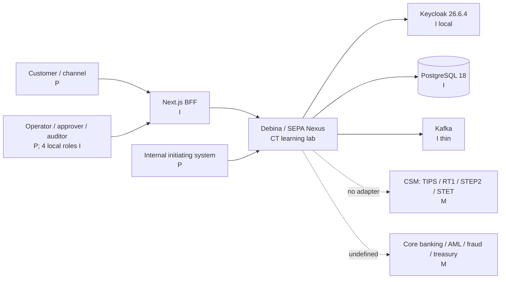

Tenancy is designed as multi-tenant/multi-participant through tenant/branch IDs and RLS, but implemented RLS covers only selected tables. Product responsibility: intake, validation, lifecycle, route/profile decision, settlement orchestration, ledger evidence, egress transport, read-only reconciliation and case coordination. Customer authentication/SCA, core posting, AML/fraud and actual CSM settlement boundaries lack executable integration contracts and cannot be silently assigned to Debina.

## B.6. Capability map

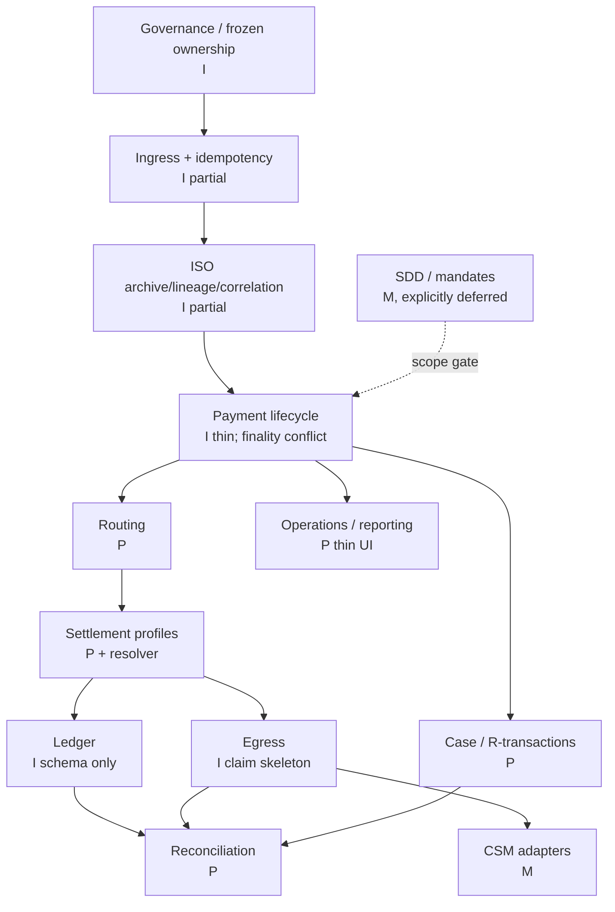

## B.7. E2E journeys

### Outgoing SCT

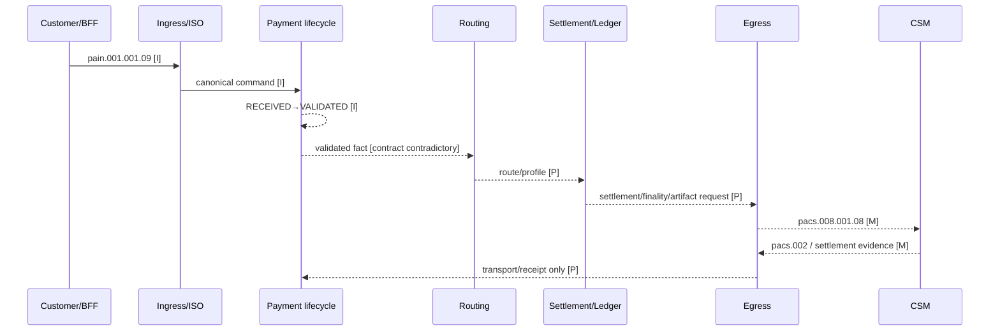

### Incoming SCT

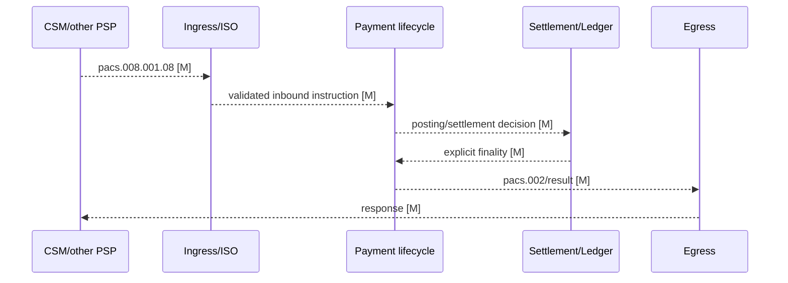

### Outgoing SCT Inst

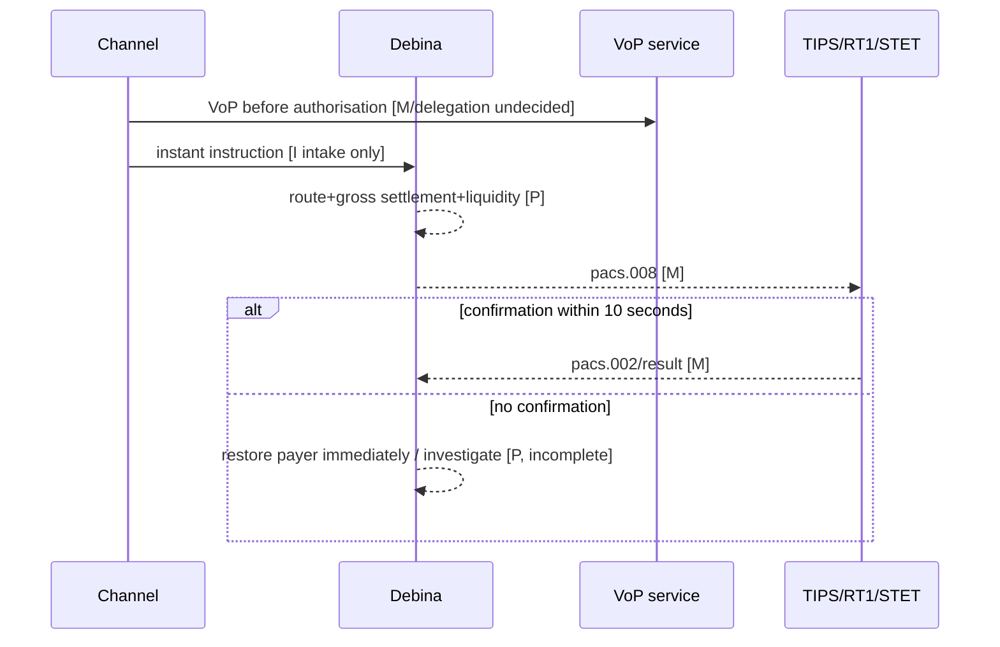

### Incoming SCT Inst

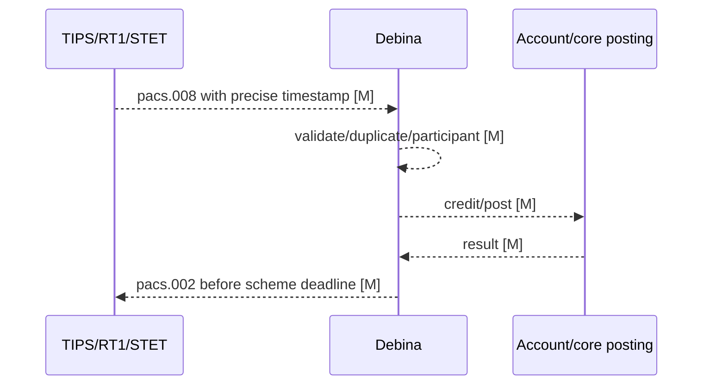

### SDD collection (required only after explicit scope change)

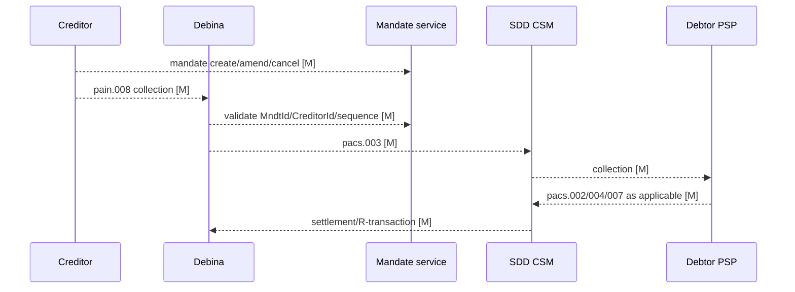

### R-transaction and recall

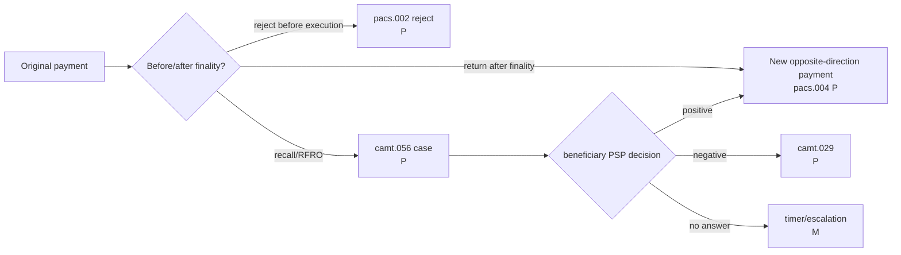

### Reconciliation

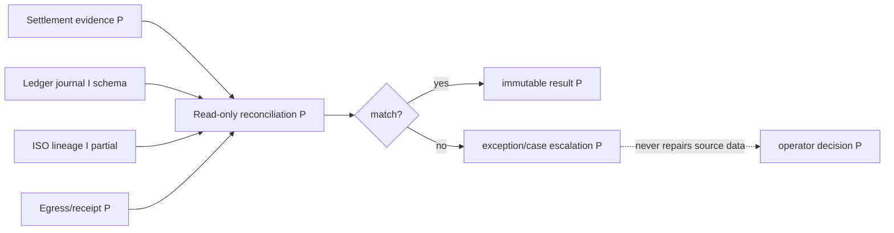

### Bank–Debina–CSM

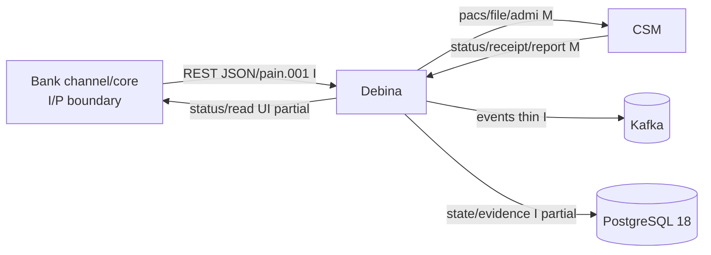

## B.8. Lifecycle and state machine

The frozen model requires five independent axes: business status, ISO status, finality, transport status and receipt status. Actual Java FSM has only `RECEIVED`, `VALIDATED`, `REJECTED`, `DISPATCHED`; `DISPATCHED` is terminal and history marks terminal as `is_final`, which violates the frozen rule.

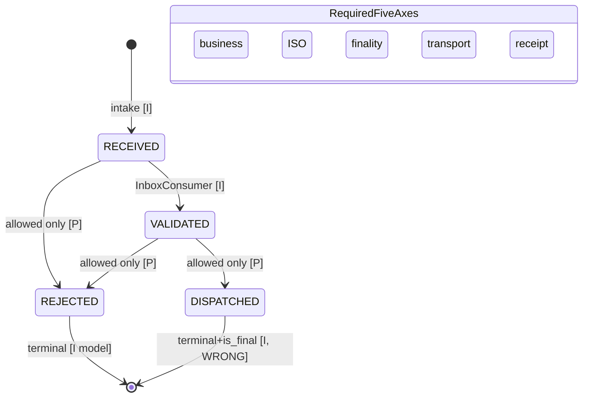

Corrective rule is not a new design: implement EPIC-39/47 according to frozen ADR and remove the false implication `DISPATCHED ⇒ final`. Incoming and outgoing need distinct journeys but may share the five-axis vocabulary. Event application needs expected-version/transition uniqueness so redelivery and concurrent responses cannot produce two transitions. `max(seq)+1` in history is not concurrency-safe.

## B.9. ISO processing and Kafka publication

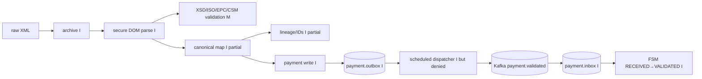

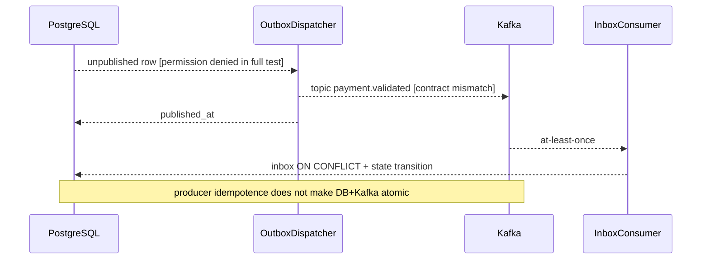

Outbox event type is `payment.submitted.v1`, dispatcher publishes it on `payment.validated`, while AsyncAPI assigns `payment.received` ingress→payment-lifecycle and `payment.validated` payment-lifecycle→routing. This is a semantic contract defect. No retry topics, DLQ, event schema/version registry, replay runbook or per-aggregate partition-key contract is executable. Topic payloads in AsyncAPI are `{}`.

## B.10. Operator process for a stuck payment

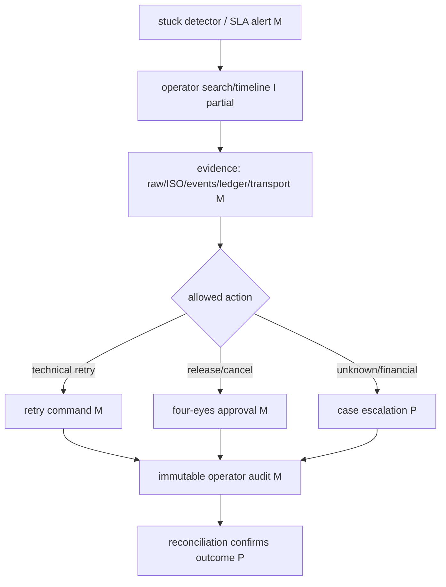

Current UI provides submit/list/detail/timeline only. No retry/release/cancel/manual match/DLQ/stuck/maker-checker command exists. A manual operation must have role, precondition, expected version, idempotency key, maker/checker separation, immutable evidence and reconciliation outcome; it must not directly edit source status.

## B.11. Standards-to-requirements traceability matrices

Status legend: `I` implemented, `P` planned, `M` missing, `NA-scope` explicitly outside current lab.

### SCT

| ID | External source/version | Requirement | Capability→process | EPIC/story | Implementation / event / table / test | Status / gap / confidence |
|---|---|---|---|---|---|---|
| TR-SCT-001 | EPC SCT RB 2025 v1.1 + IG EPC115-06 v1.0 | Inter-PSP CT pacs.008.001.08 | ISO→outgoing SCT | EPIC-29/43 | no renderer/adapter | M; BLOCKER; high |
| TR-SCT-002 | same | Reject pacs.002.001.10 with scheme reasons | correlation→FSM/case | EPIC-27.3,30,65–66 | extractor/table tests; no ingress/FSM | P/I fragment; HIGH; high |
| TR-SCT-003 | same | Return pacs.004.001.09 is related/new flow | return→settlement/ledger | EPIC-42/66 | design only | P; CRITICAL; high |
| TR-SCT-004 | same | Recall/RFRO and response | camt.056→case→camt.029/pacs.004 | EPIC-65–72 | design only | P; HIGH; high |
| TR-SCT-005 | same | non-receipt/value-date claims | camt.027/camt.087 | coarse 72.4/P2 | absent | M; HIGH; high |
| TR-SCT-006 | EPC C2PSP IG | pain.001.001.09 intake | ingress | 19.4 | endpoint, raw/ISO/payment tests | I partial; no scheme validation; high |

### SCT Inst

| ID | External source/version | Requirement | Capability→process | EPIC/story | Implementation | Status / gap / confidence |
|---|---|---|---|---|---|---|
| TR-SI-001 | EPC SCT Inst RB 2025 v1.1/IG EPC122-16 | pacs.008/pacs.002 24/7 | gross instant | 33/36 | resolver only | P; BLOCKER; high |
| TR-SI-002 | Regulation EU 2024/886 | max 10 s; restore if no confirmation | timeout/compensation | 33/36 intent | no E2E/timer | M; CRITICAL; high |
| TR-SI-003 | EU 2024/886 + EPC VoP v1.0 | VoP before authorisation, free | delegated/channel boundary | no owner | absent | M/OPEN boundary; HIGH; high |
| TR-SI-004 | EPC IG | precise timestamps incl. milliseconds | ISO validation/lineage | 28 | processing time substituted | SPRZECZNE; HIGH; high |
| TR-SI-005 | EPC IG | Recall answer within 15 banking business days | case/timers | 65–72 | absent | M; HIGH; high |

### SDD Core/B2B

| ID | Source | Requirement | Capability/process | EPIC/story | Implementation | Status |
|---|---|---|---|---|---|---|
| TR-SDD-001 | EPC SDD Core RB 2025 v1.1 / IG EPC114-06 | mandate + pain.008/pacs.003 collection | SDD Core both directions | none | none | NA-current-scope; BLOCKER if full hub |
| TR-SDD-002 | same | Core refund: 8 weeks authorised; 13 months unauthorised | refund/claim | none | none | NA-current-scope |
| TR-SDD-003 | EPC SDD B2B RB 2025 v1.1 | debtor PSP validates/stores mandate; no authorised refund | B2B mandate/collection | none | none | NA-current-scope |
| TR-SDD-004 | SDD IG | reject/return/refund/reversal distinct | R flows | none | none | NA-current-scope |
| TR-SDD-005 | SDD IG DS-08–DS-11 | some claims/templates have no dedicated ISO XML | manual/alternative channel | none | none | M; do not invent message |

### Integration/security/reconciliation/operations

| ID | Source | Requirement | Capability/process | Evidence chain | Status |
|---|---|---|---|---|---|
| TR-INT-001 | TIPS UDFS R2026.JUN | current CSM transport/schema/cert profile | egress/ingress adapter | no participant pack/adapter | BRAK DANYCH; BLOCKER certification |
| TR-INT-002 | RT1/STEP2 restricted docs | participant SLA/error/certification | adapters | public marketing only | BRAK DANYCH |
| TR-SEC-001 | internal target blueprint | target roles/SoD | Keycloak→backend→RLS→UI | 12 target vs 4 realm; missing aud | partial; CRITICAL |
| TR-REC-001 | frozen ADR | recon detects/escalates, never repairs | EPIC-57–64 | no code/table/UI | P; HIGH |
| TR-OPS-001 | internal screen specs | search/history/manual recovery/audit | EPIC-24/50/64/72 | submit/list/detail only | partial; HIGH |
| TR-DATA-001 | frozen ledger ADR | triple LedgerPort + append-only balanced ledger | EPIC-13/32 | schema/tests, no port; cross-currency balance bug | partial; BLOCKER money movement |

This matrix covers the highest-risk rows. Story-level internal linkage for all 76 epics is in Aneks A; full expansion to 279 story rows is a recommended governed artifact, not falsely presented as complete because the current graph itself marks 261 stories `NOT_DEEP_DIVED`.

## B.12. Minimal risk-based test evidence required

| Critical flow | Minimal evidence before claiming readiness |
|---|---|
| Customer intake | component/API + DB transaction + concurrent idempotency + raw evidence + invalid precision/currency |
| ISO | secure parse + official XSD/TVS/profile fixtures + negative business rules + version/namespace + lineage property tests |
| SCT/SCT Inst | contract/CSM simulator + state transition + timeout + duplicate/out-of-order + settlement/ledger + negative reason matrix |
| SDD | mandate state machine + Core/B2B decision tables + calendar/boundary values + all R types + manual non-XML claim paths |
| Kafka | Testcontainers broker + topic contract + key/order + duplicate/replay + DB/outbox crash windows + DLQ/recovery |
| Ledger | PostgreSQL Testcontainers + cross-currency/missing-account/reversal constraints + concurrency + append-only grants |
| Security | realm import + issuer/audience/roles + endpoint matrix + RLS tenant matrix + maker/checker + operator audit |
| Recon/ops | mismatch scenarios + repeatability + no-repair invariant + stuck/DLQ/manual command concurrency |

The current tests are strong for several DDL and mutation-proof slices, but no Playwright tests exist, frontend CI explicitly does not run them, and the full backend run produced scheduler permission errors while individual tests continued. HTTP-only assertions cannot prove payment lifecycle correctness.
