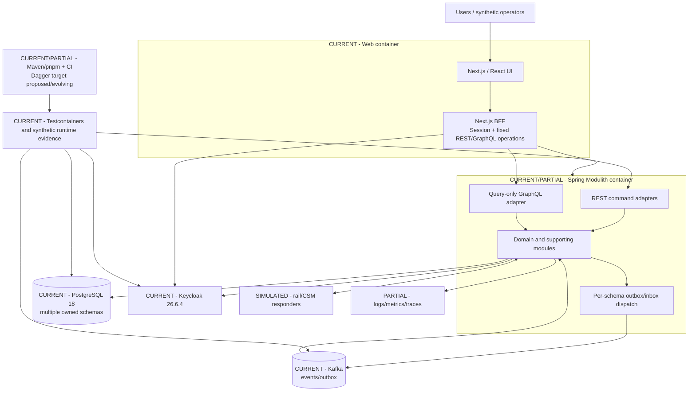

# 1. Purpose

Pokazać główne uruchamialne kontenery i techniczne granice Debina na baseline.

# 2. Scope

UI/BFF, backend, data, messaging, identity, CI/test i observability.

# 3. Non-goals

- pełny deployment diagram;
- każdy Spring Modulith component;
- produkcyjne HA/SLA;
- future VOP/SDD containers.

# 4. Current verified facts

Aplikacja pozostaje jednym backend deployable i osobnym Next.js UI/BFF; dane są w PostgreSQL, messaging w Kafka, auth w Keycloak.

# 5. Assumptions and open questions

- Dokładny lokalny compose topology należy ponownie sprawdzić przed importem.
- Dagger/observability maturity jest częściowa/proponowana.

# 6. Main content

## Container responsibilities

| Container | Status | Responsibility | Does not own |
|---|---|---|---|
| Next.js UI | CURRENT/PARTIAL | Role-scoped workspaces and views | Domain rules/data |
| Next.js BFF | CURRENT | Session, fixed operations, token containment | Domain authorization decisions alone |
| Spring Modulith | CURRENT/PARTIAL | Commands, lifecycle, ports, events, persistence orchestration | External rail truth without evidence |
| PostgreSQL 18 | CURRENT | Schema-owned state, constraints, RLS/grants | Cross-schema write convenience |
| Kafka | CURRENT/PARTIAL | Asynchronous integration/outbox | Business truth/finality |
| Keycloak | CURRENT | Authentication/roles/claims | Tenant data isolation alone |
| Rail simulators | SIMULATED | Deterministic external responses | Certification fidelity |
| CI/Dagger | PARTIAL/PROPOSED | Reproducible checks | Duplicated business logic |
| Observability | PARTIAL | Operational signals | Repair/decision authority |

# 7. Relationships to existing artifacts

Context: `../context/debina-context.md`. Module boundaries: `../domain-boundaries.md`.

# 8. Risks

- one backend container mistaken for one domain module;
- Kafka status treated as business status;
- BFF becoming business layer;
- proposed Dagger/observability presented as complete.

# 9. Evidence and canonical sources

C4 requirements, planning foundation/current-state, ADR-N17, AGENTS.

# 10. Review triggers

Deployment topology change, new deployable, extraction to service, new external dependency.
