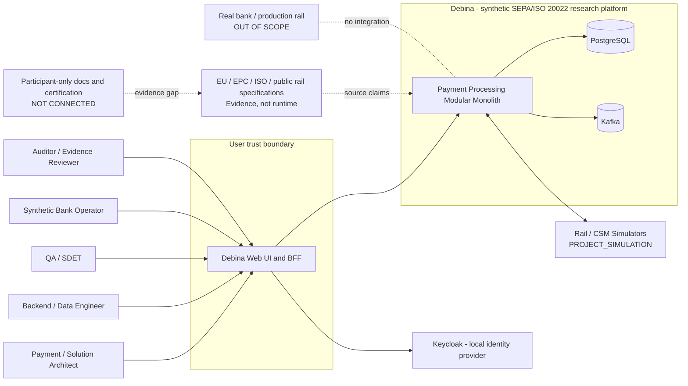

# 1. Purpose

Pokazać Debinę, jej użytkowników i zewnętrzne granice bez sugerowania rzeczywistego uczestnictwa w railach.

# 2. Scope

C4 System Context dla laboratoryjnego środowiska.

# 3. Non-goals

- deployment detail;
- participant onboarding/certification;
- dokładne rail protocols;
- model prawdziwych danych klientów.

# 4. Current verified facts

Debina jest lokalną/syntetyczną platformą badawczą; integracje railowe są symulowane albo oparte na publicznych specyfikacjach.

# 5. Assumptions and open questions

- PSP/Bank to syntetyczne role/organizacje.
- Źródła standardów nie są runtime dependency, lecz authority/evidence input.

# 6. Main content

## Legend

- **CURRENT:** UI/BFF, Spring Modulith, PostgreSQL, Kafka, Keycloak, selected synthetic journeys.
- **SIMULATED:** rail responses and external participants.
- **EXTERNAL EVIDENCE:** law, EPC, ISO, public rail documents.
- **NOT CONNECTED:** production bank/rail and participant portals.

## Trust boundaries

1. Browser/session boundary at BFF and Keycloak.
2. Module/data ownership boundary inside Debina.
3. Local test infrastructure boundary.
4. External document/evidence boundary.
5. No production-data or participant credential boundary in this project.

# 7. Relationships to existing artifacts

Container detail: `../containers/debina-containers.md`. Domain detail: `../domain-boundaries.md`.

# 8. Risks

- diagram interpreted as production integration;
- public standards interpreted as runtime service;
- simulator behavior treated as rail truth.

# 9. Evidence and canonical sources

C4 requirements, Context Map, ADR-N15, Source Authority Matrix.

# 10. Review triggers

New external system, rail adapter admission, change to deployment/trust boundary, product scope ADR.
