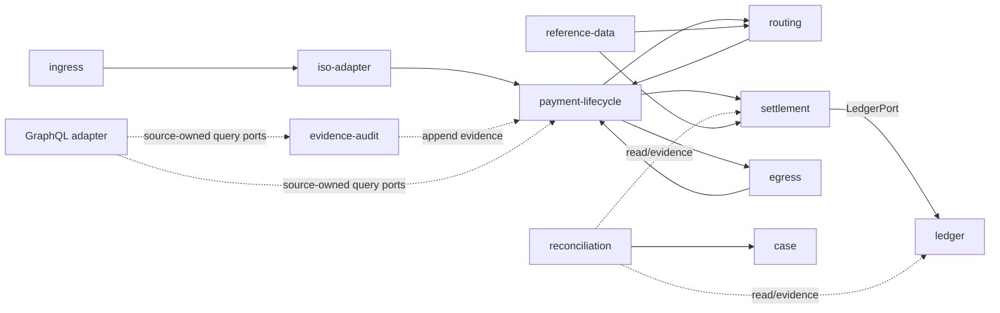

# 1. Purpose

Rozwinąć istniejący Context Map do użytecznego katalogu odpowiedzialności bez dokonywania split/merge modułów.

# 2. Scope

Domain modules, supporting modules i technical adapters.

# 3. Non-goals

- zatwierdzanie nowych modułów;
- pełny package/class catalog;
- zmiana schematów;
- definiowanie participant-only rail behavior.

# 4. Current verified facts

`payment-lifecycle` jest spine. One writer owns each schema. Finality jest settlement-owned. GraphQL i BFF są adapterami technicznymi.

# 5. Assumptions and open questions

- Dokładny stan fizycznego wyodrębnienia `iso-adapter` wymaga lokalnego package/module audit.
- Niektóre schemas/modules istnieją częściowo, zanim capability jest kompletna.
- VOP/EDS/SDD ownership nie jest przyjęty.

# 6. Main content

| Boundary | Responsibility | Owned data/schema | Public integration | Forbidden responsibility/dependency | Maturity |
|---|---|---|---|---|---|
| `ingress` | Przyjęcie kanału, raw/staging, idempotency envelope | `ingress (+ batch)` | Canonical intake ports; raw message events | Nie interpretuje settlement/finality | EXISTS |
| `iso-adapter` | Parse/map/validate/lineage/correlation ISO | `iso` | Canonical mapping, lineage/query, correlation events | Nie zapisuje payment.*; nie wymyśla identifiers | PARTIAL; część tymczasowo w payment package |
| `payment-lifecycle` | Business lifecycle spine, commands, approval | `payment` | Payment commands, visibility/query ports, domain events | Nie posiada transport/finality/ledger posting | PARTIAL |
| `signature` | Weryfikacja i podpis artefaktów | `signature` | Verification/signing/key registry ports | Nie staje się generic crypto platform | EXISTS |
| `routing` | Kandydaci, eligibility, reachability, decyzja | `routing (planned/partial)` | Routing decision/explanation ports/events | Nie definiuje finality ani settlement strategy przez nazwę CSM | PARTIAL |
| `settlement` | Strategy resolution, cycles, liquidity, finality authority | `settlement` | Settlement command/query/events; calls LedgerPort | Nie zapisuje ledger.* bez LedgerPort; egress status nie finalizuje | PARTIAL |
| `ledger` | Append-only journal/reservations | `ledger` | LedgerPort | Brak direct foreign writes/reversal-after-finality | PARTIAL |
| `egress` | Outbound artifacts, delivery attempts, transport status | `egress` | Outbound dispatch/delivery ports/events | Nie ustala finality | PARTIAL |
| `reconciliation` | Read-only detection, mismatch, escalation | `reconciliation (future)` | Evidence readers, exception events | Nie naprawia danych i nie zapisuje foreign schemas | SPECIFIED_ONLY |
| `case` | Decision/coordination dla R/claims/investigations | `case (future)` | Case commands/events, evidence bundle ports | Nie jest settlement/ledger repair engine | SPECIFIED_ONLY |
| `reference-data` | Effective configuration/catalogs/profiles | `reference_data` | Versioned lookup/query ports | Nie przechowuje mutable runtime state | PARTIAL |
| `risk` | Policy decisions such as limits/screening | `risk (future/partial)` | Risk decision ports/events | Nie miesza scheme validation z sanctions snapshot | SPECIFIED_ONLY |
| `simulation` | Synthetic responses through public paths | `simulation (future)` | Public response/event inputs | Nie omija production-like public boundaries | SPECIFIED_ONLY |
| `reporting` | Customer/operational reporting projections | `reporting (future)` | Source-owned read ports/projections | Nie jest generic database query layer | SPECIFIED_ONLY |
| `identity-access/security` | Identity, roles, session claims | `security/Keycloak DB` | Auth context/authorization policy | Nie zastępuje RLS/data ownership | EXISTS/PARTIAL |
| `evidence-audit` | Append-only evidence and audit query | `evidence, audit` | Audit append/query ports | Raw evidence never deduplicated; no domain ownership takeover | PARTIAL |
| `graphql adapter` | Composed Query-only operational reads | `no domain schema ownership` | Thin resolvers over source-owned ports | No Mutation/Subscription/generic CRUD/repository access | PARTIAL |
| `Next.js BFF/UI` | Session boundary, fixed operations, presentation | `no domain DB ownership` | REST/GraphQL allowlist | No raw token/payload exposure; no business rule ownership | PARTIAL |

## 6.1 Dependency principles

Diagram pokazuje kierunek logiczny, nie pełny Spring Modulith dependency graph.

## 6.2 Admission checklist dla nowej odpowiedzialności

- source-backed use case/quality scenario;
- owner/data boundary;
- existing module fit;
- public interface i dependency direction;
- security/RLS/grants;
- transaction boundary;
- failure/recovery;
- operational evidence;
- reversibility;
- ADR, gdy dotyka frozen boundary.

# 7. Relationships to existing artifacts

Rozwija `CONTEXT-MAP.md`; szczegółowe allowed dependencies, schemas i testy pozostają w module docs, code i epics.

# 8. Risks

- katalog staje się deklaracją implementacji;
- technical adapter uznany za bounded context;
- schema ownership mylony z read access;
- future SDD/VOP modelowany przed use cases.

# 9. Evidence and canonical sources

Context Map, Architecture Method, AGENTS/README, planning epics.

# 10. Review triggers

Module admission, schema change, new cross-context flow, superseding ADR, VOP/SDD product decision.
