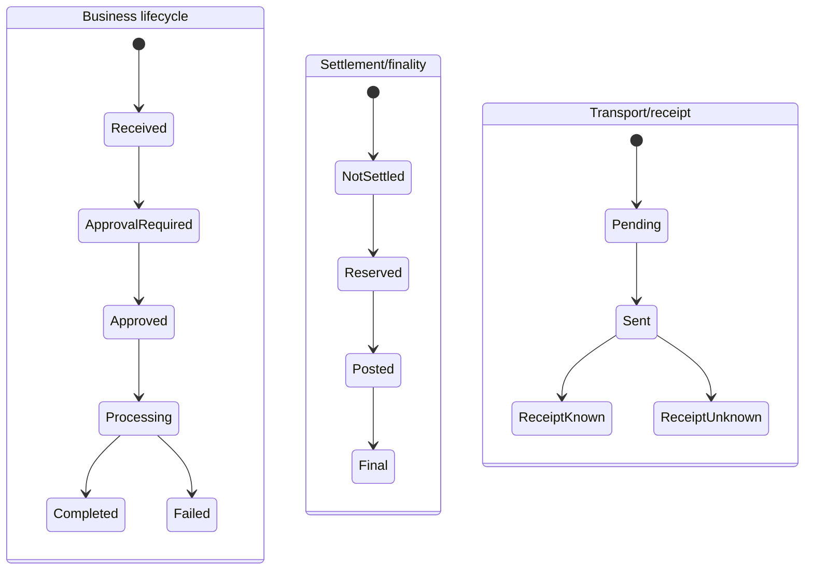

# 1. Purpose

Zapobiec kolapsowi wielu semantycznie różnych osi stanu do jednego `payment_status`.

# 2. Scope

Customer instruction, payment business, ISO, rail/transport/receipt, settlement/finality, ledger, case i reconciliation lifecycles.

# 3. Non-goals

- dokładne rail-specific timeouts/cut-offs bez źródeł;
- finalna state machine SDD/VOP;
- zastąpienie istniejących FSM i katalogów statusów.

# 4. Current verified facts

Projekt ma frozen requirement utrzymywania odrębnych osi business, ISO, finality, transport i receipt. Settlement jest autorytetem finality; egress tylko transportu.

# 5. Assumptions and open questions

- Nazwy stanów poniżej są modelem syntezy; implementacyjne enumy/katalogi pozostają kanoniczne.
- Rail submission/receipt wymagają rail-specific sources.
- SDD claims wymagają osobnego case/evidence lifecycle.

# 6. Main content

## 6.1 Osie lifecycle

| Oś | Owner | Przykładowa semantyka | Czego nie wolno z niej wnioskować |
|---|---|---|---|
| Customer instruction | ingress/payment-lifecycle | received, authenticated, accepted/rejected | settlement/finality |
| Payment business | payment-lifecycle | created, approval-required, approved, processing, completed/failed | transport receipt |
| ISO message | iso-adapter | parsed, validated, correlated/orphaned/ambiguous | business acceptance bez mappingu |
| Rail submission | rail adapter/egress | prepared, submitted, acknowledged/unknown | scheme success/finality |
| Transport | egress | pending, claimed, sent, retryable, exhausted | receipt/finality |
| Receipt | egress/rail adapter | no receipt, positive/negative/unknown receipt | settlement finality |
| Settlement | settlement | pending, reserved, posted, failed | delivery status |
| Finality | settlement authority | not-final, final, conflict | transport success |
| Ledger/accounting | ledger | reservation/journal component/posting | business case closure |
| Investigation/claim | case | opened, evidence requested, decided, action requested, closed | automatic ledger repair |
| Reconciliation | reconciliation | observed, matched/mismatched, escalated/resolved | write repair |

## 6.2 Cross-axis model

Osie są skorelowane zdarzeniami, ale nie są jedną maszyną stanów.

## 6.3 Global invariants

1. `delivered != final`.
2. `receipt-positive != ledger-posted`.
3. accepted/posted/delivered nie są zamienne.
4. Return after finality jest nową płatnością opposite-direction, nie odwróceniem immutable journal.
5. Egress nie zapisuje settlement finality.
6. Reconciliation nie naprawia danych.
7. Case koordynuje decyzję i actions, ale nie przejmuje ownership payment/ledger.
8. Retry musi być idempotentny i odróżniać unknown outcome od explicit reject.
9. Brak identyfikatora nie może być zastąpiony wartością syntetyczną.

## 6.4 Future VOP lifecycle (proposal, evidence required)

`requested -> response_received -> result_presented -> payer_decision_recorded -> expired/audited`

Wyniki: Match, Close Match, No Match, Verification Not Possible. To proces przed autoryzacją transferu, nie pole pacs.008.

## 6.5 Future SDD lifecycle (proposal, product decision required)

Oddzielne osie:

- mandate version lifecycle;
- collection lifecycle;
- scheme R-transaction lifecycle;
- authorised refund claim;
- unauthorised claim/evidence;
- mandate-copy request/evidence;
- settlement/accounting/reporting.

Nie kopiować Core refund semantics do B2B.

# 7. Relationships to existing artifacts

Implementacyjne stany pozostają w kodzie, migracjach, EPIC-20/39/45/47 i przyszłych use cases.

# 8. Risks

- zbyt ogólne nazwy wykorzystane jako enum bez source review;
- rail timeout wymyślony z EPC scheme flow;
- finality przypisana receiptowi;
- SDD model skrócony do message mapping.

# 9. Evidence and canonical sources

Frozen architecture, settlement/finality epics, source authority, EPC/rail evidence gaps.

# 10. Review triggers

Nowy status axis, rail adapter, SDD/VOP UC, settlement/finality ADR, egress receipt implementation.
