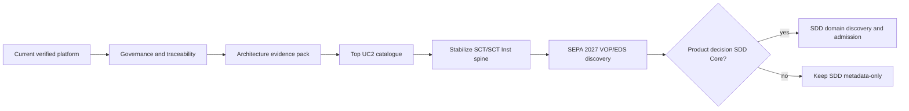

# 1. Purpose

Opisać proponowaną ewolucję Debina bez zmiany przyjętej topologii i bez uruchamiania implementacji.

# 2. Scope

Governance, traceability, architecture evidence, stabilization istniejącego spine oraz warunkowe future capabilities.

# 3. Non-goals

- migracja do microservices;
- masowy podział modułów;
- production rail connectivity;
- jednoczesne wdrażanie SCT Inst, VOP, EDS i SDD;
- automatyczne utworzenie epików.

# 4. Current verified facts

Zobacz `current-state.md`. Target zachowuje Spring Modulith, frozen invariants i source authority.

# 5. Assumptions and open questions

Każda pozycja `DECISION_REQUIRED` lub `EVIDENCE_REQUIRED` nie jest zatwierdzonym targetem implementacyjnym.

# 6. Main content

| Obszar | Current | Proposed target | Najmniejszy krok | Risk | Reversibility | Admission status |
|---|---|---|---|---|---|---|
| Governance | Scattered but strong methods | One navigable synthesis + accepted UC2 pilot | Current pack + review | Low | Reversible | ADMITTED after human review |
| Traceability | Strong per-story evidence, incomplete master linkage | Source claim -> UC slice -> module/contract -> test/evidence | Pilot on 3 existing flows | Medium | Reversible | PROPOSED |
| Rule/version management | Several catalogs, no complete 2027 cutover capability | Effective-dated scheme/message/channel profiles with draft/active/superseded states | RFC and reference-data fit analysis | High | Medium | DECISION_REQUIRED |
| Credit-transfer spine | Multiple verified slices, lifecycle gaps | Complete SCT/SCT Inst exception, retry, receipt, recon slices | Stabilize existing modules, no new topology | Medium | High | PROPOSED |
| Architecture evidence | Methods exist; C4 pack incomplete | Reviewed context/container/deployment + selected dynamics | Import and review this pack; add demand-driven dynamics | Low | Reversible | PROPOSED |
| Smoke | Runtime proofs exist, common smoke gate incomplete | Small API/runtime smoke command with synthetic data | Specify six/non-browser smoke checks | Medium | Reversible | PROPOSED |
| VOP | Absent | Source-backed Requesting/Responding PSP capability | Acquire API YAML; UC2; owner admission | High | Medium | EVIDENCE_REQUIRED |
| EDS | Absent | Versioned ingestion/activation/rollback/staleness capability | Acquire files/access model; evaluate reference-data ownership | High | Medium | EVIDENCE_REQUIRED |
| SDD Core | Absent | Separate mandate/collection/R/claims/reporting capabilities | Product decision then UC2/domain admission | High | Low after data model | DECISION_REQUIRED |
| Rail adapters | Synthetic/public evidence only | One rail at a time with evidence/certification boundary | Adapter admission after docs | High | Medium | EVIDENCE_REQUIRED |
| Agent workflow | Methods/manual handoff exist | Documentation runway, single-writer, health-gated automation | Add lightweight work overlay and hooks later | Medium | Reversible | PROPOSED |

## 6.1 Target architecture principles

- Jeden deployable Spring Modulith pozostaje domyślny.
- Nowa capability najpierw szuka deep home w istniejącym module.
- Public ports/events są granicą; foreign schema writes są zabronione.
- Scheme rules, rail behavior i bank channel profiles pozostają oddzielne.
- Effective dates i source versions są częścią decyzji runtime.
- Propozycja nie staje się implementacją bez accepted use case, admission i approval.

## 6.2 Evolution path

## 6.3 Candidate ownership for future capabilities

- Effective-dated scheme registry: evaluate `reference-data` first; new module only if independent lifecycle/commands/failure recovery justify it.
- EDS: evaluate authenticated ingestion adapter + reference-data-owned snapshot before a new bounded context.
- VOP: likely independent business lifecycle, but requires UC2 and module admission.
- SDD: do not force into credit-transfer FSM; product decision and domain model first.

# 7. Relationships to existing artifacts

Aligns directly with rebase phases B-G. Does not supersede ADR or planning.

# 8. Risks

- target treated as accepted architecture;
- future capability induces premature module;
- current spine neglected in favor of new scheme;
- evidence acquisition underestimated.

# 9. Evidence and canonical sources

Current-state snapshot, capability map, rebase program, architecture method, corpus gaps.

# 10. Review triggers

Human acceptance, module admission, RFC/ADR, final 2027 sources, completion of top UC2 catalogue.
